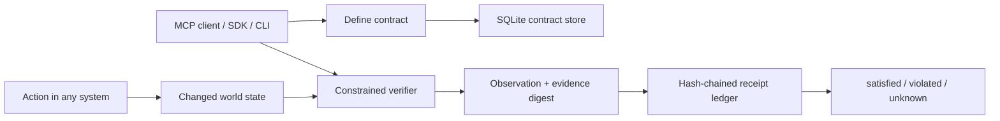

# Architecture

## Boundary

Postcondition starts where an action runner stops. It accepts a desired outcome,
but it neither chooses nor executes the action. This separation lets the same
contract verify work performed by an MCP tool, a human, CI, a script, or a remote
agent.

## Layers

1. `schemas.ts` validates public contract and attestation inputs.
2. `runtime.ts` owns lifecycle semantics and dispatches verification.
3. `verifiers/` contains narrow read-only observers.
4. `store.ts` persists contracts and observations in SQLite.
5. `server.ts` exposes the runtime through MCP.
6. `cli.ts` exposes the same runtime to terminal and CI workflows.

There is no separate code path that lets an MCP call bypass validation, evidence
classification, or the ledger.

## Contract state

Contracts begin as `pending`. Each observation updates their current state to
`satisfied`, `violated`, or `unknown`. A retraction marks the contract
`retracted`; it does not delete prior observations. The observation history is
the source for explaining state changes.

## Receipt integrity

The evidence object is canonicalized and hashed. The receipt is then
canonicalized with its evidence digest and the previous receipt hash and hashed
again. Ledger verification walks from the first observation to the last.

The chain is global rather than per contract so deleting or reordering receipts
across contracts breaks continuity. See `LIMITATIONS.md` for the distinction
between this local integrity check and externally anchored signatures.
